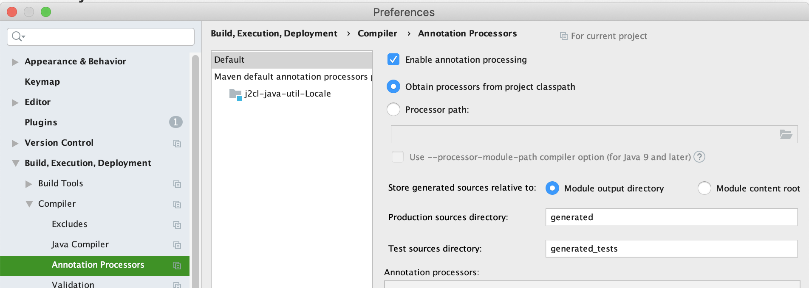

[](https://travis-ci.com/mP1/j2cl-java-util-Locale.svg?branch=master)
[](https://coveralls.io/github/mP1/j2cl-java-util-Locale?branch=master)
[](https://opensource.org/licenses/Apache-2.0)
[](https://lgtm.com/projects/g/mP1/j2cl-java-util-Locale/context:java)
[](https://lgtm.com/projects/g/mP1/j2cl-java-util-Locale/alerts/)


# j2cl java.util.Locale

This project aims to provide a mostly complete `java.util.Locale` supporting most but not all features.

- See [j2cl-java-util-locale-annotation-processor](https://github.com/mP1/j2cl-java-util-locale-annotation-processor) for more info about selecting which currencies get bundled.
- All constants except ROOT have been removed.
- Locales with two forms such as `he` and `iw` is honoured.
- Complex Locales which include variants such as `ja-JP-u-ca-japanese-x-lvariant-JP` are not supported.
- Unusual exceptions such as `no-NO-NY` remain.
- Locale#toLanguageTag should be basically the same.
- Locale#forLanguage is limited to parsing language tags without variants and works best with only language, country and script components.
- Serialization is not supported, and all support classes and forms including magic methods such as `writeReplace` are removed.


## Available methods

Most but not all methods are available. Some of the more complex such as `Locale#getDisplayName` have been removed.

- TODO


## Transpiling

The `j2cl-maven-plugin` will shade the source during the transpile phase, so `walkingkooka.j2cl.java.util.Locale`
is available to the runtime as `java.util.Locale`. 


## Getting the source

You can either download the source using the "ZIP" button at the top
of the github page, or you can make a clone using git:

```
git clone git://github.com/mP1/j2cl-java-util-Locale.git
```


### IDE build setup

Annotation processors from class path must be enabled as some tests test the output of generated classes.

The star/wildcard may need to be escaped with a backslash.



